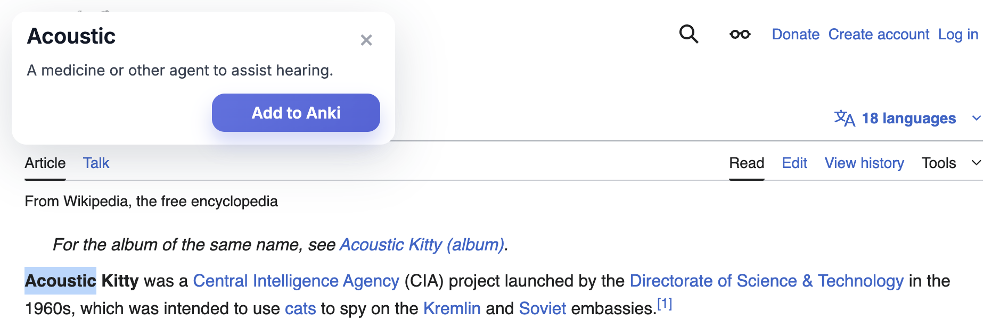
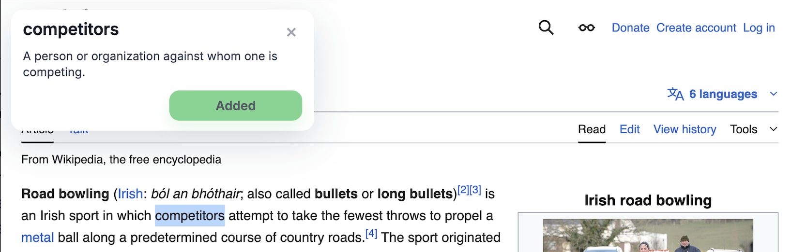
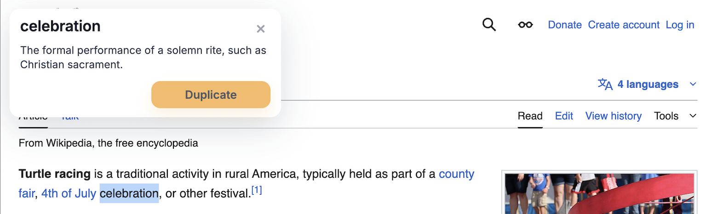
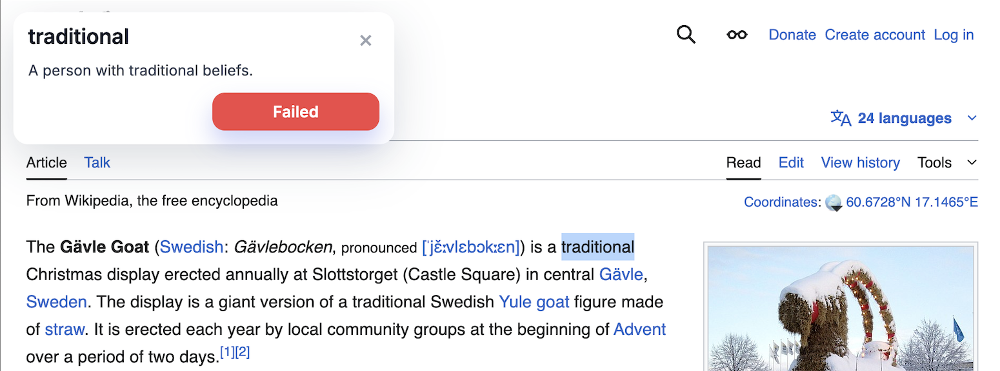

<h1>
  
  Vocab Builder
</h1>

Vocab Builder is a **minimal, distraction-free Chrome extension** that lets you select a single word on any webpage and add it directly to **Anki** with one click.

It is designed for **high-frequency reading and studying**: no popups, no toolbar UI, no settings, and no clutter. Highlight a word, wait a moment, and add it to your vocabulary deck.

---

## What This Extension Does

- Detects when you select **one valid English word** on a webpage
- Fetches the **first available dictionary definition** for that word
- Shows a small tooltip in the **top-left corner** of the page
- Adds the word and definition to Anki via **AnkiConnect**
- Automatically prevents duplicate cards (**case-insensitive**)

---

## Usage Examples

### 1. Selecting a Word
After selecting a single English word and holding the selection steady for ~1 second, the tooltip appears with the word, its definition, and an action button.

---

### 2. Successfully Added
When the card is successfully added to Anki, the button updates to **Added** and the tooltip closes automatically.

---

### 3. Duplicate Card
If the word already exists in your Anki deck, the button shows **Duplicate** and the tooltip closes.

---

### 4. Failed (Anki Not Open)
If Anki is not running or AnkiConnect is unreachable, the button shows **Failed**.

---

## Requirements

Before using this extension, make sure you have:

1. **Google Chrome** (or any Chromium-based browser)
2. **Anki** installed on your computer
3. **AnkiConnect** installed and enabled in Anki  
   - AnkiConnect must be running on the default endpoint: http://127.0.0.1:8765
4. **Anki must be open** while using the extension  
   - If Anki is closed, the extension will show **Failed** when you try to add a card

---

## Installation (Chrome – Developer Mode)

This extension is loaded manually (it is not published on the Chrome Web Store).

1. Clone or download this repository:
   git clone https://github.com/your-username/vocab_builder.git

2. Open Chrome and navigate to:
   chrome://extensions

3. Enable **Developer mode** (top-right toggle)

4. Click **Load unpacked**

5. Select the root project folder:
   vocab_builder/

6. The extension should now be active

---

## How to Use

1. Open **Anki** (required)
2. Navigate to any webpage (Google, Wikipedia, articles, blogs, etc.)
3. Select a **single English word**
4. Hold the selection steady for approximately **1 second**
5. A tooltip will appear in the top-left corner showing:
   - The word
   - Its dictionary definition
   - An **Add to Anki** button
6. Click **Add to Anki**

### Button Feedback

- **Added** → Card successfully added to Anki
- **Duplicate** → Card already exists in the deck
- **Failed** → Anki is closed or AnkiConnect is unreachable

The tooltip automatically closes after **Added** or **Duplicate**.

---

## Duplicate Handling

- Duplicate detection is **case-insensitive**
- Examples:
  - Webpage
  - webpage
  - WEBPAGE
- All are treated as the same card
- Cards are stored in lowercase in Anki to ensure consistent deduplication
- Duplicate detection works across sessions, not just the current page

---

## Deck and Note Configuration

- **Deck name:** Vocabulary
- **Note model:** Basic
- **Front:** normalized word (lowercase)
- **Back:** dictionary definition
- **Duplicates:** disallowed
- **Tags:** vocab-builder

If the deck does not exist, it is created automatically.

---

## Design Philosophy

Vocab Builder is intentionally minimal:

- No popup window
- No toolbar UI
- No options page
- No storage or analytics
- No tracking

Everything happens **in-page**, only when you explicitly select a word.

The goal is to support **flow-state reading and studying** without interruptions.

---

## Technical Overview

- **Manifest Version:** MV3
- **Architecture:**
  - content.js – selection detection, UI, dictionary lookup
  - worker.js – AnkiConnect integration
  - styles.css – fully isolated tooltip styling
- **Dictionary API:** https://api.dictionaryapi.dev
- **Async safety:** token-based system prevents stale UI updates

---

## Supported and Unsupported Behavior

### Supported

- Google, Wikipedia, articles, blogs, most websites
- Repeated use across many pages
- Automatic cleanup on scroll, selection change, or escape key

### Intentionally Unsupported

- Multi-word selections
- Phrases or sentences
- Grammatical normalization (for example: intelligent vs intelligently)
- Offline dictionary usage

---

## Known Limitations

- Anki must be running
- Definitions depend on availability from dictionaryapi.dev
- Words with no available definition close silently

---

## License

MIT License

